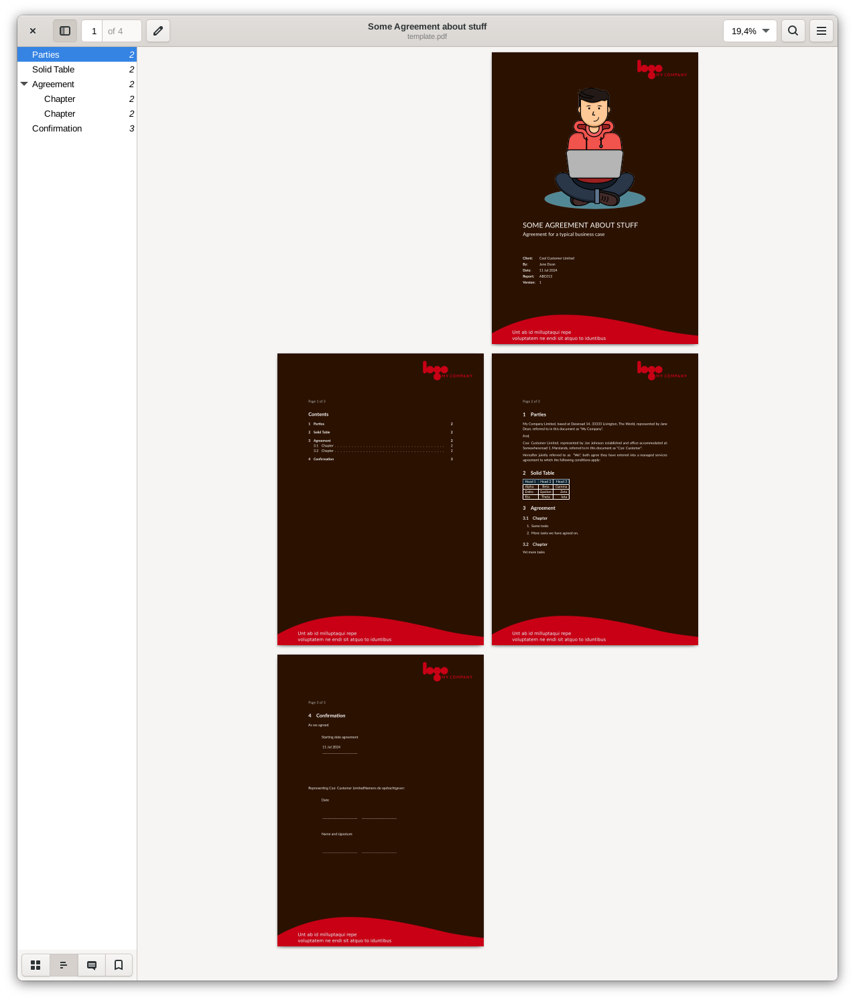
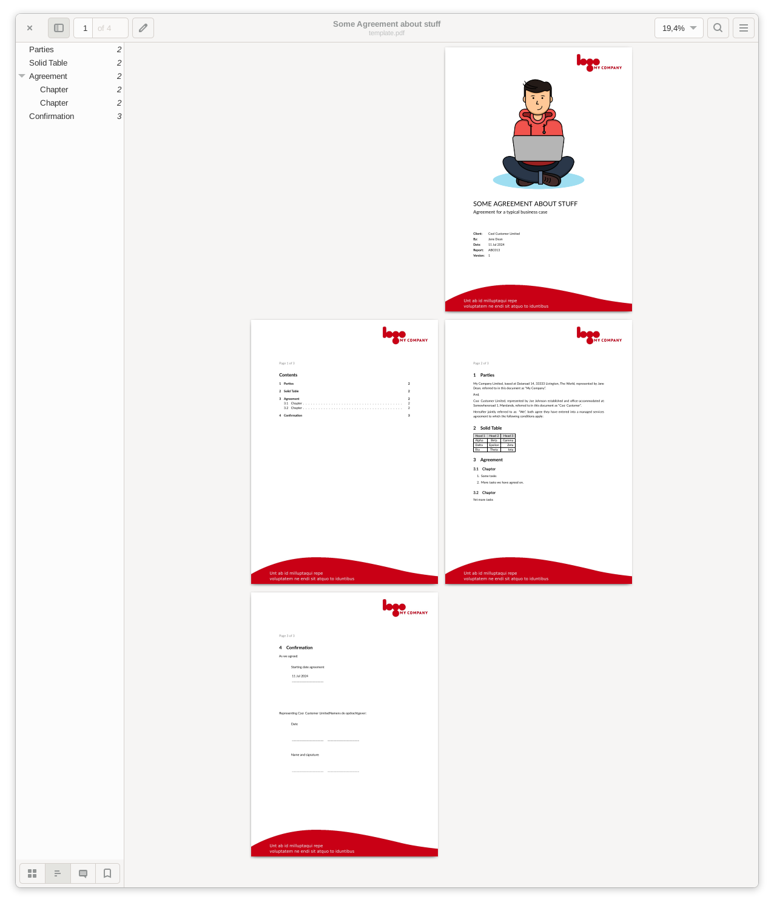

# TexNative PDF Format

Modern customizable Business Document Format for creating clean Reports,
Quotations, Letters etc...

## Installing

```bash
quarto use template wearetechnative/texnative
```

This will install the extension and create an example qmd file that you can use
as a starting place for your article.

## Features

- modern business document
- white and dark background
- custom letterhead en frontpage images
- filter to create modern looking tables
- advanced styling properties for markdown tables





## Using

Include this in your front matter.

```yaml
format: texnative-pdf
filters:
  - texnative
```

Have a look at the `temlate.qmd`. This generates [this pdf](template.pdf).

## Optional Frontmatter

When set, these values are used in the cover page.

```yaml
subtitle: Agreement for a typical business case
author: Jane Dean
date: last-modified
type: Report
document_version: 1
document_number: ABC013
```

## Format Options

```yaml
# DOCUMENT DEFAULT CONFIGURATION
toc: true                                        # show table of contents
toc-title: Contents                              # title of table of contents
cover_page: true                                 # generate cover page
letterhead: true                                 # use a letterhead background
dark_background: true                            # use the dark bg or letterhead with white text
page_numbers: true                               # show page numbers
paragraph_numbers: true                          # show paragraph numbers before headers
papersize: a4

urlcolor: magenta                                # color of url's
linkcolor: magenta                               # color of markdown defined links
colorlinks: true                                 # use colors for links

letterhead_img: bgwhite.jpg                      # path to background image
letterhead_img_darkbg: bgdark.jpg                # path to background image for dark background
cover_illustration_img: cover-ill.png            # path to cover page illustration image
cover_illustration_img_darkbg: cover-ill.png     # path to cover page illustration image for dark background
disable_justify: false                           # true: justify left and right, false: only justify left;
```

## Custom letterhead

Change `letterhead_img`, `letterhead_img_darkbg`, `cover_illustration_img` and
`cover_illustration_img_darkbg` with images which fit your Corporate Identity.
At TechNative we use an extra internal extension which provides all assets
with our corporate identity.

Our `_quarto.yml` looks like this: 

```yaml
filters:
  - quarto
  - texnative
dark_background: true
disable_justify: true
format: texnative-pdf
toc-depth: 4
letterhead_img: _extensions/technative-internal/quarto-technative-branding/letterhead-technative.png
letterhead_img_darkbg: _extensions/technative-internal/letterhead-technative-dia.png
cover_illustration_img: _extensions/technative-internal/quarto-technative-branding/unleash_white.jpg
cover_illustration_img_darkbg: _extensions/technative-internal/quarto-technative-branding/unleash.jpg
```

## Tables

TexNative includes a custom table filter that renders professional tables with
colored headers and proper formatting. Tables support rich text formatting,
configurable column widths, and captions with cross-reference labels.

### Examples

Checkout [example_markdown_tables.md](./example_tables.md) for many table examples. It's
rendered to [example_markdown_tables.pdf](./example_tables.pdf).

Pandoc Grid tables are also supported checkout [example_grid_tables.md](example_grid_tables.md) and [example_grid_tables.pdf](example_grid_tables.pdf).

### Rich Text in Cells

Table cells preserve inline formatting including:

- **Bold**: `**bold text**`
- *Italic*: `*italic text*`
- `Code`: `` `code` ``
- Links: `[text](https://example.com)`

Example with rich text:

```markdown
| Feature    | Description           | Status     |
|:-----------|:---------------------:|------------|
| **Parser** | Handles *all* formats | `complete` |
| Exporter   | [Docs](https://x.com) | _pending_  |
```

### Column Widths

Control column widths using the `tbl-colwidths` attribute in the table caption.
Values are percentages that should sum to 100 or less.

```markdown
| Name       | Description                          | Price |
|:-----------|:-------------------------------------|------:|
| Widget     | A useful widget for various tasks    |  9.99 |
| Gadget     | An advanced gadget with features     | 19.99 |

: Product catalog {tbl-colwidths="[20,60,20]"}
```

When no widths are specified, columns use automatic sizing based on alignment.

### Captions and Labels

Add captions and cross-reference labels using Quarto's standard syntax:

```markdown
| Head 1 | Head 2 |
|--------|--------|
| A      | B      |

: My table caption {#tbl-mytable}
```

Reference the table elsewhere with `@tbl-mytable`.

### Custom Table Colors

You can customize the header and body background colors at both document-level
(in YAML front matter) and per-table (in caption properties).

**Document-level YAML options:**

```yaml
table-header-bgcolor: "255,128,0"    # RGB format
table-body-bgcolor: "255,240,220"    # RGB format
```

**Per-table caption properties:**

```markdown
| Feature | Status |
|---------|--------|
| Auth    | Done   |
| API     | WIP    |

: Status table {tbl-header-bgcolor="0,100,200" tbl-body-bgcolor="230,240,255"}
```

Colors can be specified as:
- RGB format: `"255,128,0"` 
- Hex format: `"#ff8000"` or `"ff8000"`

Per-table colors override document-level settings, which override theme defaults.

**Dark background defaults:**

When `dark_background: true` is set, tables automatically use:
- Header: `#471d00` (dark orange-brown)
- Body: `#6d2b00` (medium orange-brown)

### Table Properties Reference

Quick reference for all available table configuration options.

**Document-level YAML properties:**

| Property | Format | Default (light) | Default (dark) | Description |
|:---------|:-------|:----------------|:---------------|:------------|
| `table-header-bgcolor` | RGB `"R,G,B"` or Hex `"#RRGGBB"` | Theme default | `#471d00` | Header background color |
| `table-body-bgcolor` | RGB `"R,G,B"` or Hex `"#RRGGBB"` | Transparent | `#6d2b00` | Body background color |
| `table-header-txtcolor` | RGB `"R,G,B"` or Hex `"#RRGGBB"` | Black | White | Header text color |
| `table-body-txtcolor` | RGB `"R,G,B"` or Hex `"#RRGGBB"` | Black | White | Body text color |
| `table-border-color` | RGB `"R,G,B"` or Hex `"#RRGGBB"` | Black | `#8b4513` | Border color |
| `table-border-width` | Number (pt) | 0.4 | 0.4 | Border width (0 = none) |
| `table-cell-padding` | Number (pt) | 6 | 6 | Cell padding |
| `table-alignment` | `left` / `center` / `right` | left | left | Horizontal placement |

**Per-table caption properties:**

| Property | Format | Default | Description |
|:---------|:-------|:--------|:------------|
| `#tbl-<id>` | Label ID | None | Cross-reference label for the table |
| `tbl-colwidths` | `"[n,n,...]"` (percentages) | Auto | Column width distribution |
| `tbl-header-bgcolor` | RGB `"R,G,B"` or Hex `"#RRGGBB"` | Document setting | Header background color |
| `tbl-body-bgcolor` | RGB `"R,G,B"` or Hex `"#RRGGBB"` | Document setting | Body background color |
| `tbl-header-txtcolor` | RGB `"R,G,B"` or Hex `"#RRGGBB"` | Document setting | Header text color |
| `tbl-body-txtcolor` | RGB `"R,G,B"` or Hex `"#RRGGBB"` | Document setting | Body text color |
| `tbl-border-color` | RGB `"R,G,B"` or Hex `"#RRGGBB"` | Document setting | Border color |
| `tbl-border-width` | Number (pt) | Document setting | Border width (0 = none) |
| `tbl-cell-padding` | Number (pt) | Document setting | Cell padding |
| `tbl-alignment` | `left` / `center` / `right` | left | Horizontal placement |

**Property precedence:** Per-table caption properties override document-level YAML properties, which override theme defaults.

**Example with styling properties:**

```markdown
| Feature | Description | Status |
|:--------|:------------|-------:|
| Auth    | OAuth 2.0   | Done   |

: Feature status {#tbl-features tbl-colwidths="[30,50,20]" tbl-header-bgcolor="0,100,180" tbl-header-txtcolor="255,255,255" tbl-border-color="0,100,180" tbl-border-width="1" tbl-alignment="center"}
```

### Advanced Grid Table Features

TexNative supports Pandoc's grid table syntax with advanced features including
column alignment, block content (bullet lists), and hard line breaks.

#### Column Alignment

Specify column alignment using colons at the boundaries of the separator line
after the header:

```markdown
+---------------+---------------+--------------------+
| Right         | Left          | Centered           |
+==============:+:==============+:==================:+
| Bananas       | 1.34          | built-in wrapper   |
+---------------+---------------+--------------------+
```

- Right-aligned: `+==============:+` (colon on right)
- Left-aligned: `+:==============+` (colon on left)
- Centered: `+:==============:+` (colons on both sides)
- Default: `+===============+` (no colons)

For headerless tables, place colons on the top line instead.

#### Bullet Lists in Cells

Grid tables can contain bullet lists within cells:

```markdown
+---------------+---------------+--------------------+
| Fruit         | Price         | Advantages         |
+===============+===============+====================+
| Bananas       | 1.34          | - built-in wrapper |
|               |               | - bright color     |
+---------------+---------------+--------------------+
| Oranges       | 2.10          | - cures scurvy     |
|               |               | - tasty            |
+---------------+---------------+--------------------+
```

Lists render with compact spacing suitable for table cells.

#### Hard Line Breaks

Use two spaces at the end of a line or a backslash to create hard line breaks
within cell content. This allows multiple lines of text in a single cell without
creating separate paragraphs.

#### Multiple Paragraphs

Grid tables support multiple paragraphs within a single cell. Separate paragraphs
are rendered with appropriate spacing.

For more grid table examples, see `example_grid_tables.qmd`.

## Credits

Illustration is created by Illustrations.co from the 'Life' collection.
